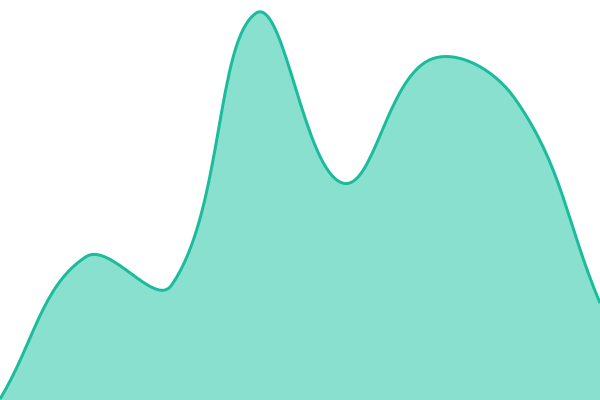
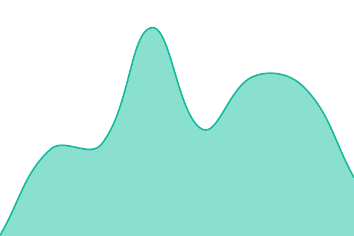

# [📈 Live Status](https://announcekit.github.io/announcekit-status): <!--live status--> **🟩 All systems operational**

This repository contains the open-source uptime monitor and status page for [announcekit](https://announcekit.github.io/announcekit-status), powered by [Upptime](https://github.com/upptime/upptime).

With [Upptime](https://upptime.js.org), you can get your own unlimited and free uptime monitor and status page, powered entirely by a GitHub repository. We use [Issues](https://github.com/announcekit/announcekit-status/issues) as incident reports, [Actions](https://github.com/announcekit/announcekit-status/actions) as uptime monitors, and [Pages](https://announcekit.github.io/announcekit-status) for the status page.

<!--start: status pages-->
<!-- This summary is generated by Upptime (https://github.com/upptime/upptime) -->
<!-- Do not edit this manually, your changes will be overwritten -->
<!-- prettier-ignore -->
| URL | Status | History | Response Time | Uptime |
| --- | ------ | ------- | ------------- | ------ |
|  [Website](https://announcekit.app) | 🟩 Up | [website.yml](https://github.com/announcekit/announcekit-status/commits/HEAD/history/website.yml) | 

 257ms
     
 | 

<a href="https://status.announcekit.app/history/website">100.00%</a>
    

|  [Dashboard](https://announcekit.app/dashboard) | 🟩 Up | [dashboard.yml](https://github.com/announcekit/announcekit-status/commits/HEAD/history/dashboard.yml) | 

 170ms
     
 | 

<a href="https://status.announcekit.app/history/dashboard">100.00%</a>
    

|  [API](https://announcekit.app/gq/v2) | 🟩 Up | [api.yml](https://github.com/announcekit/announcekit-status/commits/HEAD/history/api.yml) | 

 134ms
     
 | 

<a href="https://status.announcekit.app/history/api">100.00%</a>
    

|  [Widget CDN](https://cdn.announcekit.app/widget-v2.js) | 🟩 Up | [widget-cdn.yml](https://github.com/announcekit/announcekit-status/commits/HEAD/history/widget-cdn.yml) | 

 100ms
     
 | 

<a href="https://status.announcekit.app/history/widget-cdn">100.00%</a>
    

|  [Changelog Pages](https://changelog.announcekit.app) | 🟩 Up | [changelog-pages.yml](https://github.com/announcekit/announcekit-status/commits/HEAD/history/changelog-pages.yml) | 

 437ms
     
 | 

<a href="https://status.announcekit.app/history/changelog-pages">100.00%</a>
    

|  [Image CDN](https://img.announcekit.app/c10f62bbae1530a45a4feb09fb514cc7?w=100&s=1af07b4643b45671e954007410a8847d) | 🟩 Up | [image-cdn.yml](https://github.com/announcekit/announcekit-status/commits/HEAD/history/image-cdn.yml) | 

 102ms
     
 | 

<a href="https://status.announcekit.app/history/image-cdn">100.00%</a>
    

|  [MCP Server](https://mcp.announcekit.app/health) | 🟩 Up | [mcp-server.yml](https://github.com/announcekit/announcekit-status/commits/HEAD/history/mcp-server.yml) | 

 208ms
     
 | 

<a href="https://status.announcekit.app/history/mcp-server">100.00%</a>
    

<!--end: status pages-->

[**Visit our status website →**](https://announcekit.github.io/announcekit-status)

## 📄 License

- Powered by: [Upptime](https://github.com/upptime/upptime)
- Code: [MIT](./LICENSE) © [Anand Chowdhary](https://anandchowdhary.com)
- Data in the `./history` directory: [Open Database License](https://opendatacommons.org/licenses/odbl/1-0/)
